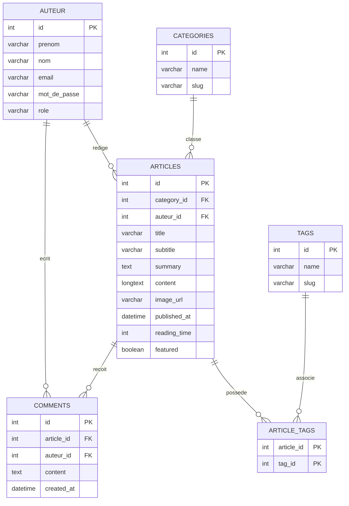

# Modelisation de la base de donnees - Clutch Time Media

Ce document presente la modelisation relationnelle du blog. Il sert a montrer
la demarche attendue avant la creation des tables SQL.

## 1. Besoin fonctionnel

Le blog doit permettre de gerer :

- des articles avec un titre, un sous-titre, un resume, un contenu, une image,
  une date de parution et un temps de lecture ;
- des categories pour classer les articles ;
- des commentaires rattaches aux articles ;
- des auteurs pour les articles et les commentaires ;
- des tags rattaches aux articles.

## 2. Entites principales

### AUTEUR

La table `auteurs` represente les auteurs du blog. Un auteur peut rediger
plusieurs articles et plusieurs commentaires.

Champs principaux :

- `id` : identifiant unique de l'auteur ;
- `prenom` : prenom ;
- `nom` : nom ;
- `email` : email unique ;
- `mot_de_passe` : mot de passe chiffre ;
- `role` : role de l'auteur, par exemple `admin` ou `author`.

### categories

La table `categories` permet de classer les articles par theme.

Champs principaux :

- `id` : identifiant unique de la categorie ;
- `name` : nom de la categorie ;
- `slug` : version courte du nom, utile dans une URL.

Relation :

- une categorie peut contenir plusieurs articles ;
- un article appartient a une seule categorie.

### articles

La table `articles` contient le contenu principal du blog.

Champs principaux :

- `id` : identifiant unique de l'article ;
- `category_id` : categorie de l'article ;
- `auteur_id` : auteur de l'article ;
- `title` : titre ;
- `subtitle` : sous-titre ;
- `summary` : resume court ;
- `content` : texte complet ;
- `image_url` : image de l'article ;
- `published_at` : date de parution ;
- `reading_time` : temps de lecture ;
- `featured` : indique si l'article est affiche a la une.

### comments

La table `comments` contient les commentaires publies sous les articles.

Champs principaux :

- `id` : identifiant unique du commentaire ;
- `article_id` : article commente ;
- `auteur_id` : auteur du commentaire ;
- `content` : contenu du commentaire ;
- `created_at` : date de creation.

Relation :

- un article peut avoir plusieurs commentaires ;
- un commentaire appartient a un seul article ;
- Un auteur peut rediger plusieurs commentaires.

### tags

La table `tags` contient les mots-cles associes aux articles.

Champs principaux :

- `id` : identifiant unique du tag ;
- `name` : nom du tag ;
- `slug` : version courte du tag.

### article_tags

La table `article_tags` est une table d'association.
Elle permet de gerer la relation plusieurs-a-plusieurs entre `articles` et
`tags`.

Relation :

- un article peut avoir plusieurs tags ;
- un tag peut etre utilise par plusieurs articles.

## 3. MCD simplifie

## 4. MLD

Le modele logique relationnel se traduit ainsi :

- `auteurs(id, prenom, nom, email, mot_de_passe, role, created_at)`
- `categories(id, name, slug, created_at)`
- `articles(id, category_id, auteur_id, title, subtitle, summary, content, image_url, published_at, reading_time, featured, created_at, updated_at)`
- `comments(id, article_id, auteur_id, content, created_at)`
- `tags(id, name, slug, created_at)`
- `article_tags(article_id, tag_id)`

Cles etrangeres :

- `articles.category_id` reference `categories.id`
- `articles.auteur_id` reference `auteurs.id`
- `comments.article_id` reference `articles.id`
- `comments.auteur_id` reference `auteurs.id`
- `article_tags.article_id` reference `articles.id`
- `article_tags.tag_id` reference `tags.id`

## 5. Points importants pour la soutenance

- Le fichier JSON actuel simule les donnees du blog.
- La base MySQL proposee permettrait de remplacer ce JSON par de vraies tables.
- La relation article/tag est une relation plusieurs-a-plusieurs.
- La table `article_tags` est obligatoire pour representer proprement cette relation.
- Les cles primaires identifient chaque ligne.
- Les cles etrangeres assurent les liens entre les tables.

## 6. Saisie dans Looping

Pour reproduire le MCD dans Looping, utiliser le fichier :

- `docs/saisie-looping.md`

Il contient les entites, les proprietes, les associations et les cardinalites a
saisir dans le logiciel.
